<div align="center">

# ⚠️ Rundeck Set ROI Defaults Plugin

[](https://rundeck.com)
[](https://openjdk.java.net/)
[](https://opensource.org/licenses/Apache-2.0)
[](https://www.linux.org/)
[](https://github.com/your-org/rundeck-setroidefaults)
[](#-support-disclaimer)

*A Rundeck Workflow Step Plugin to automatically manage ROI (Return on Investment) metric defaults for jobs*

[⚠️ Risk Warnings](#-risk-warnings--disclaimers) • [Features](#-features) • [Installation](#-installation) • [Configuration](#-configuration) • [Usage](#-usage) • [Troubleshooting](#-troubleshooting)

</div>

---

## ⚠️ RISK WARNINGS & DISCLAIMERS

### 🚨 CRITICAL WARNINGS - READ BEFORE USE

**⚠️ THIS PLUGIN MODIFIES JOB DEFINITIONS**
- This plugin **DIRECTLY MODIFIES** Rundeck job definitions
- Changes are **PERMANENT** and affect job configurations
- **ALWAYS** test in a non-production environment first
- **ALWAYS** use dry-run mode before applying changes
- **BACKUP** your job definitions before use

**⚠️ NO WARRANTIES OR SUPPORT**
- This plugin is provided **"AS-IS"** with **NO WARRANTIES** of any kind
- **NO IMPLIED SUPPORT** from PagerDuty or Rundeck
- Use at your **OWN RISK** - you are responsible for any issues
- **STRONGLY ADVISED** to thoroughly test before production use

**⚠️ PRODUCTION USE WARNINGS**
- **TEST EXTENSIVELY** in development/staging environments
- **VERIFY PERMISSIONS** - ensure API token has minimal required access
- **MONITOR EXECUTION** - watch logs for errors or unexpected behavior
- **HAVE ROLLBACK PLAN** - know how to restore job definitions if needed

---

## 📋 Overview

The **Rundeck Set ROI Defaults Plugin** is a Workflow Step Plugin that automatically manages ROI metric defaults in Rundeck job definitions. It detects existing ROI configurations, adds missing ROI fields with default values, and tracks automation value across projects.

**⚠️ IMPORTANT**: This plugin **modifies job definitions**. Always test thoroughly before production use.

### 🎯 Key Capabilities
- **⚡ Bulk Processing**: Processes single projects or all accessible projects
- **🛡️ Dry-Run Mode**: Preview changes before applying them (STRONGLY RECOMMENDED)
- **🔍 Auto-Detection**: Automatically detects existing ROI plugin configurations
- **🔧 Workflow Integration**: Runs as a standard Rundeck workflow step
- **📊 Progress Reporting**: Provides detailed execution logs and summary statistics

---

## ✨ Features

<table>
<tr>
<td width="50%">

### 🔧 Core Functionality
- ✅ Adds "hours" field to jobs that don't have ROI metrics
- ✅ Supports dry-run mode for safe testing
- ✅ Processes single projects or all accessible projects
- ✅ Auto-detects existing ROI plugin names
- ✅ Comprehensive error handling and logging

</td>
<td width="50%">

### 🚀 Advanced Features
- ✅ Configurable default values and API versions
- ✅ Secure API token management via Key Storage
- ✅ Project filtering capabilities
- ✅ Workflow step output context for downstream steps
- ✅ Network error handling with timeouts

</td>
</tr>
</table>

---

## 📋 Requirements

| Component | Version | Notes |
|-----------|---------|-------|
| **Rundeck** | 5.x | Commercial or Self-Hosted with ROI Metrics Plugin |
| **Java** | 11+ | Required for plugin execution |
| **Operating System** | Linux | Linux environment required |
| **ROI Metrics Plugin** | Any Version | Must be installed and enabled |
| **API Access** | Token Required | With appropriate project permissions |

> **⚠️ Important**: This plugin only works with commercial versions of Rundeck (Rundeck Enterprise or Rundeck Self-Hosted) that include the ROI metrics plugin. It will not work with open-source Rundeck.
>
> 📚 **Learn more**: [ROI Metrics Documentation](https://docs.rundeck.com/docs/manual/jobs/roi-metrics.html)

---

## 🚀 Installation

### 📦 Getting the Plugin

#### Option A: Download from Releases (Recommended)
```bash
# Download the latest release
wget https://github.com/your-org/rundeck-setroidefaults/releases/download/v0.1.0/set-roi-defaults-0.1.0.jar

# Verify download
ls -la set-roi-defaults-0.1.0.jar
```

#### Option B: Building from Source

**Prerequisites:**
```bash
# Ensure you have Java 11+ and Gradle installed
java -version
gradle -version
```

**Build Steps:**
```bash
# 1. Clone the repository
git clone https://github.com/your-org/rundeck-setroidefaults.git
cd rundeck-setroidefaults

# 2. Build the plugin
gradle clean build

# 3. Locate the built plugin
ls -la build/libs/set-roi-defaults-0.1.0.jar
```

### 📤 Uploading to Rundeck

#### Method 1: Web UI Upload (Recommended)

1. **Access Plugin Management**:
   - Log into your Rundeck instance as an administrator
   - Navigate to **System** → **Plugins**
   - Click on the **Upload Plugin** tab

2. **Upload the Plugin**:
   - Click **Choose File** and select the plugin JAR file:
     - If downloaded from releases: `set-roi-defaults-0.1.0.jar`
     - If built from source: `build/libs/set-roi-defaults-0.1.0.jar`
   - Click **Upload Plugin**
   - Wait for the upload to complete

3. **Verify Installation**:
   - Go to **System** → **Plugins** → **Installed Plugins**
   - Look for "Set ROI Defaults" in the **Workflow Step** section
   - Status should show as "Enabled"

#### Method 2: File System Installation

```bash
# Copy plugin to Rundeck's plugin directory
# Use the appropriate path based on how you obtained the plugin:
# If downloaded from releases:
sudo cp set-roi-defaults-0.1.0.jar /var/lib/rundeck/libext/
# If built from source:
# sudo cp build/libs/set-roi-defaults-0.1.0.jar /var/lib/rundeck/libext/

# Set proper ownership
sudo chown rundeck:rundeck /var/lib/rundeck/libext/set-roi-defaults-0.1.0.jar

# Restart Rundeck service
sudo systemctl restart rundeckd

# Verify plugin is loaded
tail -f /var/log/rundeck/service.log | grep "set-roi-defaults"
```

### ✅ Installation Verification

1. **Check Plugin Availability**:
   - Create a new job or edit an existing one
   - Add a workflow step
   - Look for "Set ROI Defaults" in the step type dropdown

2. **Verify Dependencies**:
   - Ensure the ROI Metrics plugin is installed and enabled
   - Check that your Rundeck version supports the ROI metrics feature

---

## ⚙️ Configuration

### 🔑 API Token Setup

The plugin requires an API token stored in Rundeck's Key Storage for secure access.

#### Creating an API Token

1. **Generate Token**:
   - Log into Rundeck with appropriate permissions
   - Click your username → **Profile**
   - Go to **User API Tokens** tab
   - Click **Generate New Token**
   - Provide a name (e.g., "ROI Manager Plugin")
   - Set expiration date
   - Click **Generate Token**
   - **Copy the token immediately** (it won't be shown again)

2. **Store in Key Storage**:
   - Navigate to **System** → **Key Storage**
   - Click **Add or Upload a Key**
   - Choose **Password** type
   - Set path: `keys/roi-plugin-token` (or your preferred path)
   - Paste the API token as the password
   - Click **Save**

### 🎛️ Plugin Configuration Options

When adding the plugin as a workflow step, you'll see these configuration options:

<table>
<tr>
<th width="25%">Setting</th>
<th width="15%">Required</th>
<th width="20%">Default</th>
<th width="40%">Description</th>
</tr>
<tr>
<td><strong>API Token Path</strong></td>
<td>✅ Yes</td>
<td>-</td>
<td>Path to API token in Key Storage (e.g., <code>keys/roi-plugin-token</code>)</td>
</tr>
<tr>
<td><strong>Rundeck URL</strong></td>
<td>❌ No</td>
<td>Current instance</td>
<td>Base URL of Rundeck instance (e.g., <code>https://rundeck.company.com</code>)</td>
</tr>
<tr>
<td><strong>API Version</strong></td>
<td>❌ No</td>
<td><code>46</code></td>
<td>Rundeck API version to use</td>
</tr>
<tr>
<td><strong>Default Hours Saved</strong></td>
<td>❌ No</td>
<td><code>0.1667</code></td>
<td>Default hours saved value (0.1667 = 10 minutes)</td>
</tr>
<tr>
<td><strong>Project Filter</strong></td>
<td>❌ No</td>
<td>Current project</td>
<td>Target project (<code>all</code> for all projects, blank for current)</td>
</tr>
<tr>
<td><strong>Dry Run Mode</strong></td>
<td>❌ No</td>
<td><code>true</code></td>
<td>Preview mode - shows changes without applying them</td>
</tr>
</table>

---

## 🎮 Usage

### 📖 Adding to a Job Workflow

1. **Create or Edit a Job**:
   - Navigate to your project
   - Create a new job or edit an existing one
   - Go to the **Workflow** tab

2. **Add the Plugin Step**:
   - Click **Add a Step**
   - Select **Set ROI Defaults** from the step types
   - Configure the plugin settings (see configuration table above)
   - Click **Save**

3. **⚠️ RECOMMENDED: Start with Dry Run**:
   ```
   API Token Path: keys/roi-plugin-token
   Rundeck URL: (leave blank for current instance)
   API Version: 46
   Default Hours Saved: 0.1667
   Project Filter: (leave blank for current project)
   Dry Run Mode: true  ← ALWAYS START WITH THIS
   ```

### 🎯 Usage Scenarios

#### Scenario 1: Test on Current Project (RECOMMENDED FIRST STEP)
```
Project Filter: (blank - uses current project)
Dry Run Mode: true
```
**Result**: Shows what would be changed in the current project without making changes.

#### Scenario 2: Apply to Current Project (After Testing)
```
Project Filter: (blank - uses current project)
Dry Run Mode: false
```
**Result**: Actually applies ROI metrics to jobs in the current project.

#### Scenario 3: Process All Projects (Dry Run First)
```
Project Filter: all
Dry Run Mode: true
```
**Result**: Shows what would be changed across all accessible projects.

#### Scenario 4: Target Specific Project
```
Project Filter: production
Dry Run Mode: false  ← Only after extensive testing
```
**Result**: Applies changes only to the "production" project.

### 📊 Understanding Output

The plugin provides detailed logging during execution:

```
✅ [project] job_name - Already has hours (0.25)
🆕 [project] job_name - WOULD ADD hours [0.1667]  (dry run)
🆕 [project] job_name - Added hours field          (applied)
❌ [project] job_name - Failed to retrieve definition

Summary:
  Projects: 3
  Jobs Processed: 25
  Jobs Updated: 8
⚠️  DRY RUN MODE: No actual changes were made!
```

### 🔄 Workflow Integration

The plugin outputs context variables for use in downstream workflow steps:

| Variable | Description | Example |
|----------|-------------|---------|
| `summary.projectsCount` | Number of projects processed | `3` |
| `summary.jobsProcessed` | Total jobs examined | `25` |
| `summary.jobsUpdated` | Jobs that were/would be updated | `8` |
| `summary.dryRun` | Whether dry run mode was used | `true` |

**Example usage in subsequent steps**:
```bash
echo "Processed ${summary.jobsProcessed} jobs across ${summary.projectsCount} projects"
echo "Updated ${summary.jobsUpdated} jobs (dry run: ${summary.dryRun})"
```

---

## 🔧 How It Works

```mermaid
graph LR
    A[🔍 Plugin Detection] --> B[📊 Job Analysis]
    B --> C[➕ Field Addition]
    C --> D[🔒 Safe Updates]
    
    A1[Auto-detect ROI plugin] --> A
    B1[Check existing ROI config] --> B
    C1[Add hours field] --> C
    D1[Rundeck job import API] --> D
```

<div align="center">



</div>

### 🔍 Plugin Workflow

1. **🔍 Auto-Detection**: 
   - Scans existing jobs to detect ROI plugin name
   - Supports various ROI plugin implementations
   - Falls back to default `roi-metrics-data` if none found

2. **📊 Job Analysis**: 
   - Retrieves job definitions via Rundeck API
   - Checks each job for existing ROI metrics configuration
   - Identifies jobs missing the "hours" field

3. **➕ Field Addition**: 
   - Adds standardized "hours" field to jobs without it
   - Uses configurable default value
   - Preserves existing ROI configuration

4. **🔒 Safe Updates**: 
   - Uses Rundeck's job import API with update mode
   - Maintains job integrity and history
   - Provides rollback capability through Rundeck's job versioning

### 📋 ROI Metrics Structure

The plugin adds ROI metrics in the standard Rundeck format:

```json
{
  "plugins": {
    "ExecutionLifecycle": {
      "roi-metrics-data": {
        "userRoiData": "[{\"key\":\"hours\",\"label\":\"Hours Saved By automation\",\"desc\":\"Number of hours saved by this automation\",\"value\":\"0.1667\"}]"
      }
    }
  }
}
```

---

## 🛡️ Security & Permissions

### 🔐 Security Features

- ✅ API tokens stored securely in Rundeck Key Storage
- ✅ No credentials in job definitions or logs
- ✅ HTTPS support for API communications
- ✅ Request timeouts to prevent hanging connections
- ✅ Proper error handling without credential exposure

### 👥 Required Permissions

The API token user must have these permissions:

| Permission | Scope | Purpose |
|------------|-------|---------|
| **Read Projects** | System/Projects | List and access projects |
| **Read Jobs** | Projects | Retrieve job definitions |
| **Update Jobs** | Projects | Modify job configurations |
| **Import Jobs** | Projects | Use job import API |

### 🔒 Permission Setup Example

```yaml
# Example ACL policy for ROI plugin user
description: ROI Plugin Permissions
context:
  application: rundeck
for:
  resource:
    - allow: [read, admin]
      type: project
  project:
    - allow: [read, import, create, update]
      type: job
by:
  username: roi-plugin-user
```

---

## 🚨 Error Handling & Troubleshooting

### 🔧 Common Issues & Solutions

<details>
<summary>🚨 Plugin Not Visible in Step Types</summary>

**Symptoms**: Plugin doesn't appear in workflow step dropdown

**Solutions**:
1. Verify plugin is uploaded correctly:
   ```bash
   # Check plugin directory
   ls -la /var/lib/rundeck/libext/set-roi-defaults*
   ```

2. Check Rundeck logs:
   ```bash
   tail -f /var/log/rundeck/service.log | grep -i "set-roi-defaults\|plugin"
   ```

3. Restart Rundeck service:
   ```bash
   sudo systemctl restart rundeckd
   ```

</details>

<details>
<summary>🔑 Key Storage Access Errors</summary>

**Symptoms**: "Error accessing API token" messages

**Solutions**:
1. Verify token path exists:
   - Go to **System** → **Key Storage**
   - Confirm the path matches plugin configuration

2. Check token permissions:
   - Ensure the job execution user can read the key
   - Verify ACL policies allow key access

3. Test token manually:
   ```bash
   curl -H "X-Rundeck-Auth-Token: YOUR_TOKEN" \
        https://your-rundeck/api/46/projects
   ```

</details>

<details>
<summary>🌐 API Connection Issues</summary>

**Symptoms**: "Connection error" or timeout messages

**Solutions**:
1. Verify Rundeck URL:
   ```bash
   # Test connectivity
   curl -I https://your-rundeck-server.com
   ```

2. Check API version compatibility:
   - Try different API versions (44, 45, 46)
   - Verify your Rundeck version supports the API

3. Network troubleshooting:
   ```bash
   # Check DNS resolution
   nslookup your-rundeck-server.com
   
   # Test port connectivity
   telnet your-rundeck-server.com 443
   ```

</details>

<details>
<summary>🚫 Permission Denied Errors</summary>

**Symptoms**: "HTTP 403" or "Access denied" messages

**Solutions**:
1. Verify API token permissions:
   - Check user has project access
   - Ensure job modification rights

2. Review ACL policies:
   ```bash
   # Check ACL files
   ls -la /etc/rundeck/
   cat /etc/rundeck/*.aclpolicy
   ```

3. Test with admin token temporarily to isolate permission issues

</details>

<details>
<summary>📊 ROI Plugin Not Detected</summary>

**Symptoms**: "Could not detect ROI plugin name" warnings

**Solutions**:
1. Verify ROI plugin is installed:
   - Go to **System** → **Plugins**
   - Look for ROI-related plugins

2. Check existing job configurations:
   - Manually verify some jobs have ROI metrics
   - Note the exact plugin name used

3. Override detection by modifying the plugin code if needed

</details>

### 🔍 Debug Mode

Enable detailed logging by setting the log level in your job:

```bash
# Add this as a first step in your workflow for debugging
echo "Debug: Starting ROI plugin execution"
echo "Project: ${RD_JOB_PROJECT}"
echo "User: ${RD_JOB_USERNAME}"
```

---

## 🏗️ Development

### 📁 Project Structure

```
📦 rundeck-setroidefaults/
├── 🏗️ build.gradle                    # Build configuration
├── 📂 src/main/groovy/com/plugin/setroidefaults/
│   ├── 🔧 Setroidefaults.groovy       # Main plugin class
│   ├── 📊 RoiManager.groovy           # ROI management logic
│   ├── 🛠️ Util.groovy                # Utility functions
│   ├── ⚠️ FailureReason.groovy        # Error handling
│   └── 📋 Constants.groovy            # Configuration constants
├── 📂 src/main/resources/
│   └── 📂 resources/
│       └── 🖼️ icon.png               # Plugin icon
├── 📂 src/test/groovy/                # Test files
└── 📂 build/libs/                     # Built plugin JAR
```

### 🧪 Testing and Validation

<div align="center">

| Step | Action | Purpose |
|:----:|:-------|:--------|
| **1** | Build plugin locally | 🔍 Verify compilation |
| **2** | Upload to test Rundeck | ✅ Test installation |
| **3** | Run with dry-run mode | 🛡️ Safe validation |
| **4** | Apply to test project | 🧪 Functional testing |
| **5** | Monitor logs and output | 📊 Performance validation |

</div>

### 🔧 Building from Source

```bash
# Clone and build
git clone https://github.com/your-org/rundeck-setroidefaults.git
cd rundeck-setroidefaults

# Clean build
gradle clean build

# Run tests
gradle test

# View test results
open build/reports/tests/test/index.html
```

### 🤝 Contributing

1. 🍴 Fork the repository
2. 🌿 Create a feature branch (`git checkout -b feature/amazing-feature`)
3. 🔧 Make your changes
4. 🧪 Test thoroughly with dry-run mode
5. ✅ Validate on test Rundeck instance
6. 📤 Submit a pull request

### 📏 Best Practices

<table>
<tr>
<td>

**🛡️ Safety First**
- Always test with dry-run mode
- Use test projects for validation
- Monitor execution logs

</td>
<td>

**📊 Deployment Strategy**
- Backup job definitions
- Incremental rollout
- Monitor for issues

</td>
</tr>
</table>

---

## 📝 Changelog

<details>
<summary>📋 Version History</summary>

### 🎉 v0.1.0 (Current)
- **✨ Initial Release**: Complete plugin functionality
- **🔧 Core Features**: Auto-detection, dry-run mode, project filtering
- **🛡️ Security**: Key Storage integration for API tokens
- **📊 Reporting**: Comprehensive logging and output context
- **🚀 API Support**: Rundeck API v46 with configurable versions
- **🔍 Auto-Detection**: Automatic ROI plugin name detection
- **⚙️ Configuration**: Flexible configuration options
- **🧪 Testing**: Comprehensive test suite

### 🔮 Planned Features
- **📈 Enhanced Reporting**: Detailed ROI metrics analysis
- **🔄 Batch Processing**: Improved performance for large deployments
- **📊 Dashboard Integration**: Web UI for ROI metrics management
- **🔌 Plugin Ecosystem**: Integration with other Rundeck plugins

</details>

---

## 📄 License

<div align="center">

This project is licensed under the **Apache License 2.0**.

[](https://opensource.org/licenses/Apache-2.0)

</div>

---

## 🆘 Support Disclaimer

<div align="center">

**⚠️ IMPORTANT SUPPORT INFORMATION**

</div>

### ⚠️ No Warranties or Support

This plugin is provided **"AS-IS"** and is **NOT part of the general PagerDuty/Rundeck support program**. 

**CRITICAL DISCLAIMERS:**
- ❌ **NO WARRANTIES** of any kind, express or implied
- ❌ **NO COMMERCIAL SUPPORT** from PagerDuty or Rundeck
- ❌ **NO SLA** or guaranteed response times
- ❌ **NO LIABILITY** for any damages or issues
- ❌ **NOT OFFICIALLY MAINTAINED** by PagerDuty

### 🐛 Community Support Only

- ✅ **Community support** via GitHub issues (best effort only)
- ✅ **Documentation** provided as-is
- ✅ **Source code** available for review and modification

### 🚨 Your Responsibility

**YOU ARE RESPONSIBLE FOR:**
- Testing thoroughly before production use
- Understanding the risks and implications
- Having backup and rollback procedures
- Monitoring and maintaining the plugin
- Any issues or damages that may occur

### 🐛 Reporting Issues

When reporting issues, please include:

1. **Environment Details**:
   - Rundeck version
   - Plugin version
   - Operating system
   - Java version

2. **Configuration**:
   - Plugin settings (sanitized)
   - Project setup
   - User permissions

3. **Error Information**:
   - Complete error messages
   - Rundeck service logs
   - Job execution logs

4. **Steps to Reproduce**:
   - Detailed reproduction steps
   - Expected vs actual behavior

---

<div align="center">

**⚠️ USE AT YOUR OWN RISK ⚠️**

[](https://rundeck.com/)
[](https://groovy-lang.org/)
[](https://www.linux.org/)

*This plugin modifies job definitions - test extensively before production use*

</div>