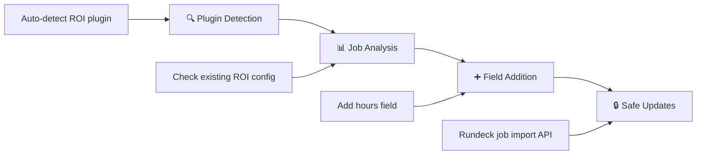

<div align="center">

# 🚀 Rundeck Set ROI Defaults Plugin

[](https://rundeck.com)
[](https://openjdk.java.net/)
[](https://opensource.org/licenses/Apache-2.0)
[](https://www.linux.org/)
[](https://github.com/your-org/rundeck-setroidefaults)
[](https://github.com/your-org/rundeck-setroidefaults)

*A Rundeck Workflow Step Plugin to automatically manage ROI (Return on Investment) metrics for jobs*

[Quick Start](#-quick-start) • [Features](#-features) • [Documentation](#-documentation) • [Build & Deploy](#-build--deploy) • [Contributing](#-contributing)

</div>

---

## 📋 Overview

The **Rundeck Set ROI Defaults Plugin** is a Workflow Step Plugin that automatically manages ROI metrics in Rundeck job definitions. It detects existing ROI configurations, adds missing ROI fields, and tracks automation value across projects - all from within your Rundeck workflows.

This plugin is the **Rundeck plugin version** of the Python script for managing ROI metrics, providing seamless integration with Rundeck workflows and enhanced security through Key Storage integration.

### 🎯 Key Capabilities
- **⚡ Bulk Processing**: Processes single projects or all accessible projects
- **🛡️ Dry-Run Mode**: Preview changes before applying them
- **🔍 Auto-Detection**: Automatically detects existing ROI plugin configurations
- **🔧 Workflow Integration**: Runs as a standard Rundeck workflow step
- **📊 Progress Reporting**: Provides detailed execution logs and summary statistics

---

## ✨ Features

<table>
<tr>
<td width="50%">

### 🔧 Core Functionality
- ✅ Adds "hours" field to jobs that don't have ROI metrics
- ✅ Supports dry-run mode for safe testing
- ✅ Processes single projects or all accessible projects
- ✅ Auto-detects existing ROI plugin names
- ✅ Comprehensive error handling and logging

</td>
<td width="50%">

### 🚀 Advanced Features
- ✅ Configurable default values and API versions
- ✅ Secure API token management via Key Storage
- ✅ Project filtering capabilities
- ✅ Workflow step output context for downstream steps
- ✅ Network error handling with timeouts

</td>
</tr>
</table>

---

## 🚀 Quick Start

### ⚡ 10-Minute Setup

1. **Build the Plugin**:
   ```bash
   git clone https://github.com/your-org/rundeck-setroidefaults.git
   cd rundeck-setroidefaults
   gradle clean build
   ```

2. **Upload to Rundeck**:
   - Go to **System** → **Plugins** → **Upload Plugin**
   - Select `build/libs/set-roi-defaults-0.1.0.jar`
   - Click **Upload Plugin**

3. **Setup API Token**:
   - Generate API token in **Profile** → **User API Tokens**
   - Store in **System** → **Key Storage** as `keys/roi-plugin-token`

4. **Test the Plugin**:
   - Create a job with **Set ROI Defaults** workflow step
   - Configure with `Dry Run Mode: true`
   - Run and verify output

📖 **Detailed Instructions**: See [`GETTING_STARTED.md`](GETTING_STARTED.md)

---

## 📚 Documentation

| Document | Description | Use Case |
|----------|-------------|----------|
| **[📖 PLUGIN_README.md](PLUGIN_README.md)** | Complete plugin documentation | Full reference guide |
| **[🚀 GETTING_STARTED.md](GETTING_STARTED.md)** | Quick setup guide | First-time installation |
| **[🏗️ BUILD_DEPLOY.md](BUILD_DEPLOY.md)** | Build and deployment guide | Development and production deployment |

### 📋 Requirements

| Component | Version | Notes |
|-----------|---------|-------|
| **Rundeck** | 5.x | Commercial or Self-Hosted with ROI Metrics Plugin |
| **Java** | 11+ | Required for plugin execution |
| **Operating System** | Linux | Linux environment required |
| **ROI Metrics Plugin** | Any Version | Must be installed and enabled |

> **⚠️ Important**: This plugin only works with commercial versions of Rundeck (Rundeck Enterprise or Rundeck Self-Hosted) that include the ROI metrics plugin.

---

## 🎮 Usage Examples

### Basic Usage (Current Project)
```yaml
Workflow Step: Set ROI Defaults
Configuration:
  API Token Path: keys/roi-plugin-token
  Project Filter: (blank - current project)
  Dry Run Mode: true
```

### Bulk Processing (All Projects)
```yaml
Workflow Step: Set ROI Defaults
Configuration:
  API Token Path: keys/roi-plugin-token
  Project Filter: all
  Dry Run Mode: false
```

### Target Specific Project
```yaml
Workflow Step: Set ROI Defaults
Configuration:
  API Token Path: keys/roi-plugin-token
  Project Filter: production
  Default Hours Saved: 0.25
  Dry Run Mode: false
```

---

## 🔧 How It Works

<div align="center">



</div>

1. **🔍 Auto-Detection**: Scans existing jobs to detect ROI plugin name
2. **📊 Job Analysis**: Checks each job for existing ROI metrics configuration
3. **➕ Field Addition**: Adds "hours" field to jobs that don't have it
4. **🔒 Safe Updates**: Uses Rundeck's job import API with update mode

### 📋 ROI Metrics Structure

The plugin adds ROI metrics in the standard Rundeck format:

```json
{
  "plugins": {
    "ExecutionLifecycle": {
      "roi-metrics-data": {
        "userRoiData": "[{\"key\":\"hours\",\"label\":\"Hours Saved By automation\",\"desc\":\"Number of hours saved by this automation\",\"value\":\"0.1667\"}]"
      }
    }
  }
}
```

---

## 🏗️ Build & Deploy

### Quick Build
```bash
# Standard build
gradle clean build

# Production build with tests
gradle clean test build

# Deploy to local Rundeck
sudo cp build/libs/set-roi-defaults-0.1.0.jar /var/lib/rundeck/libext/
sudo systemctl restart rundeckd
```

### Docker Deployment
```dockerfile
FROM rundeck/rundeck:5.0.2
COPY build/libs/set-roi-defaults-0.1.0.jar /home/rundeck/libext/
```

📖 **Complete Build Guide**: See [`BUILD_DEPLOY.md`](BUILD_DEPLOY.md)

---

## 🛡️ Security & Permissions

### 🔐 Security Features
- ✅ API tokens stored securely in Rundeck Key Storage
- ✅ No credentials in job definitions or logs
- ✅ HTTPS support for API communications
- ✅ Request timeouts to prevent hanging connections

### 👥 Required Permissions
The API token user must have:
- **Read Projects**: List and access projects
- **Read Jobs**: Retrieve job definitions
- **Update Jobs**: Modify job configurations
- **Import Jobs**: Use job import API

---

## 🚨 Troubleshooting

### Quick Fixes

| Issue | Solution |
|-------|----------|
| Plugin not visible | Restart Rundeck: `sudo systemctl restart rundeckd` |
| Key storage error | Verify token path: `keys/roi-plugin-token` |
| Permission denied | Check API token has job read/write permissions |
| No jobs found | Verify project filter and user access |

📖 **Complete Troubleshooting**: See [`PLUGIN_README.md#troubleshooting`](PLUGIN_README.md#-error-handling--troubleshooting)

---

## 🤝 Contributing

1. 🍴 Fork the repository
2. 🌿 Create a feature branch
3. 🔧 Make your changes
4. 🧪 Test with dry-run mode
5. ✅ Validate on test Rundeck instance
6. 📤 Submit a pull request

### 🧪 Development Workflow
```bash
# Build and test locally
gradle clean build test

# Deploy to development Rundeck
./deploy-roi-plugin.sh

# Test plugin functionality
# (Create test job with plugin step)
```

---

## 📄 License

This project is licensed under the **Apache License 2.0**.

[](https://opensource.org/licenses/Apache-2.0)

---

## 🆘 Support

### ⚠️ Support Disclaimer

This plugin is provided **as-is** and is **not part of the general PagerDuty/Rundeck support program**. Support is provided on a best-effort basis through community channels only.

- ✅ Community support via GitHub issues
- ❌ Not covered by PagerDuty commercial support
- ❌ No SLA or guaranteed response times

### 🐛 Reporting Issues

When reporting issues, please include:
- Rundeck version and plugin version
- Complete error messages and logs
- Plugin configuration (sanitized)
- Steps to reproduce

---

<div align="center">

**Built for DevOps Teams**

[](https://rundeck.com/)
[](https://groovy-lang.org/)
[](https://www.linux.org/)

*Streamline your ROI metrics management with automated Rundeck workflows*

</div>
[](https://rundeck.com)
[](https://openjdk.java.net/)
[](https://opensource.org/licenses/Apache-2.0)
[](https://www.linux.org/)
[](https://github.com/your-org/rundeck-setroidefaults)
[](https://github.com/your-org/rundeck-setroidefaults)

*A Rundeck Workflow Step Plugin to automatically manage ROI (Return on Investment) metrics for jobs*

[Quick Start](#-quick-start) • [Features](#-features) • [Documentation](#-documentation) • [Build & Deploy](#-build--deploy) • [Contributing](#-contributing)

</div>

---

## 📋 Overview

The **Rundeck Set ROI Defaults Plugin** is a Workflow Step Plugin that automatically manages ROI metrics in Rundeck job definitions. It detects existing ROI configurations, adds missing ROI fields, and tracks automation value across projects - all from within your Rundeck workflows.

This plugin is the **Rundeck plugin version** of the Python script for managing ROI metrics, providing seamless integration with Rundeck workflows and enhanced security through Key Storage integration.

### 🎯 Key Capabilities
- **⚡ Bulk Processing**: Processes single projects or all accessible projects
- **🛡️ Dry-Run Mode**: Preview changes before applying them
- **🔍 Auto-Detection**: Automatically detects existing ROI plugin configurations
- **🔧 Workflow Integration**: Runs as a standard Rundeck workflow step
- **📊 Progress Reporting**: Provides detailed execution logs and summary statistics

---

## ✨ Features

<table>
<tr>
<td width="50%">

### 🔧 Core Functionality
- ✅ Adds "hours" field to jobs that don't have ROI metrics
- ✅ Supports dry-run mode for safe testing
- ✅ Processes single projects or all accessible projects
- ✅ Auto-detects existing ROI plugin names
- ✅ Comprehensive error handling and logging

</td>
<td width="50%">

### 🚀 Advanced Features
- ✅ Configurable default values and API versions
- ✅ Secure API token management via Key Storage
- ✅ Project filtering capabilities
- ✅ Workflow step output context for downstream steps
- ✅ Network error handling with timeouts

</td>
</tr>
</table>

---

## 🚀 Quick Start

### ⚡ 10-Minute Setup

1. **Build the Plugin**:
   ```bash
   git clone https://github.com/your-org/rundeck-setroidefaults.git
   cd rundeck-setroidefaults
   gradle clean build
   ```

2. **Upload to Rundeck**:
   - Go to **System** → **Plugins** → **Upload Plugin**
   - Select `build/libs/set-roi-defaults-0.1.0.jar`
   - Click **Upload Plugin**

3. **Setup API Token**:
   - Generate API token in **Profile** → **User API Tokens**
   - Store in **System** → **Key Storage** as `keys/roi-plugin-token`

4. **Test the Plugin**:
   - Create a job with **Set ROI Defaults** workflow step
   - Configure with `Dry Run Mode: true`
   - Run and verify output

📖 **Detailed Instructions**: See [`GETTING_STARTED.md`](GETTING_STARTED.md)

---

## 📚 Documentation

| Document | Description | Use Case |
|----------|-------------|----------|
| **[📖 PLUGIN_README.md](PLUGIN_README.md)** | Complete plugin documentation | Full reference guide |
| **[🚀 GETTING_STARTED.md](GETTING_STARTED.md)** | Quick setup guide | First-time installation |
| **[🏗️ BUILD_DEPLOY.md](BUILD_DEPLOY.md)** | Build and deployment guide | Development and production deployment |

### 📋 Requirements

| Component | Version | Notes |
|-----------|---------|-------|
| **Rundeck** | 5.x | Commercial or Self-Hosted with ROI Metrics Plugin |
| **Java** | 11+ | Required for plugin execution |
| **Operating System** | Linux | Linux environment required |
| **ROI Metrics Plugin** | Any Version | Must be installed and enabled |

> **⚠️ Important**: This plugin only works with commercial versions of Rundeck (Rundeck Enterprise or Rundeck Self-Hosted) that include the ROI metrics plugin.

---

## 🎮 Usage Examples

### Basic Usage (Current Project)
```yaml
Workflow Step: Set ROI Defaults
Configuration:
  API Token Path: keys/roi-plugin-token
  Project Filter: (blank - current project)
  Dry Run Mode: true
```

### Bulk Processing (All Projects)
```yaml
Workflow Step: Set ROI Defaults
Configuration:
  API Token Path: keys/roi-plugin-token
  Project Filter: all
  Dry Run Mode: false
```

### Target Specific Project
```yaml
Workflow Step: Set ROI Defaults
Configuration:
  API Token Path: keys/roi-plugin-token
  Project Filter: production
  Default Hours Saved: 0.25
  Dry Run Mode: false
```

---

## 🔧 How It Works

<div align="center">


</div>

1. **🔍 Auto-Detection**: Scans existing jobs to detect ROI plugin name
2. **📊 Job Analysis**: Checks each job for existing ROI metrics configuration
3. **➕ Field Addition**: Adds "hours" field to jobs that don't have it
4. **🔒 Safe Updates**: Uses Rundeck's job import API with update mode

### 📋 ROI Metrics Structure

The plugin adds ROI metrics in the standard Rundeck format:

```json
{
  "plugins": {
    "ExecutionLifecycle": {
      "roi-metrics-data": {
        "userRoiData": "[{\"key\":\"hours\",\"label\":\"Hours Saved By automation\",\"desc\":\"Number of hours saved by this automation\",\"value\":\"0.1667\"}]"
      }
    }
  }
}
```

---

## 🏗️ Build & Deploy

### Quick Build
```bash
# Standard build
gradle clean build

# Production build with tests
gradle clean test build

# Deploy to local Rundeck
sudo cp build/libs/set-roi-defaults-0.1.0.jar /var/lib/rundeck/libext/
sudo systemctl restart rundeckd
```

### Docker Deployment
```dockerfile
FROM rundeck/rundeck:5.0.2
COPY build/libs/set-roi-defaults-0.1.0.jar /home/rundeck/libext/
```

📖 **Complete Build Guide**: See [`BUILD_DEPLOY.md`](BUILD_DEPLOY.md)

---

## 🛡️ Security & Permissions

### 🔐 Security Features
- ✅ API tokens stored securely in Rundeck Key Storage
- ✅ No credentials in job definitions or logs
- ✅ HTTPS support for API communications
- ✅ Request timeouts to prevent hanging connections

### 👥 Required Permissions
The API token user must have:
- **Read Projects**: List and access projects
- **Read Jobs**: Retrieve job definitions
- **Update Jobs**: Modify job configurations
- **Import Jobs**: Use job import API

---

## 🚨 Troubleshooting

### Quick Fixes

| Issue | Solution |
|-------|----------|
| Plugin not visible | Restart Rundeck: `sudo systemctl restart rundeckd` |
| Key storage error | Verify token path: `keys/roi-plugin-token` |
| Permission denied | Check API token has job read/write permissions |
| No jobs found | Verify project filter and user access |

📖 **Complete Troubleshooting**: See [`PLUGIN_README.md#troubleshooting`](PLUGIN_README.md#-error-handling--troubleshooting)

---

## 🤝 Contributing

1. 🍴 Fork the repository
2. 🌿 Create a feature branch
3. 🔧 Make your changes
4. 🧪 Test with dry-run mode
5. ✅ Validate on test Rundeck instance
6. 📤 Submit a pull request

### 🧪 Development Workflow
```bash
# Build and test locally
gradle clean build test

# Deploy to development Rundeck
./deploy-roi-plugin.sh

# Test plugin functionality
# (Create test job with plugin step)
```

---

## 📄 License

This project is licensed under the **Apache License 2.0**.

[](https://opensource.org/licenses/Apache-2.0)

---

## 🆘 Support

### ⚠️ Support Disclaimer

This plugin is provided **as-is** and is **not part of the general PagerDuty/Rundeck support program**. Support is provided on a best-effort basis through community channels only.

- ✅ Community support via GitHub issues
- ❌ Not covered by PagerDuty commercial support
- ❌ No SLA or guaranteed response times

### 🐛 Reporting Issues

When reporting issues, please include:
- Rundeck version and plugin version
- Complete error messages and logs
- Plugin configuration (sanitized)
- Steps to reproduce

---

<div align="center">

**Built for DevOps Teams**

[](https://rundeck.com/)
[](https://groovy-lang.org/)
[](https://www.linux.org/)

*Streamline your ROI metrics management with automated Rundeck workflows*

</div>
